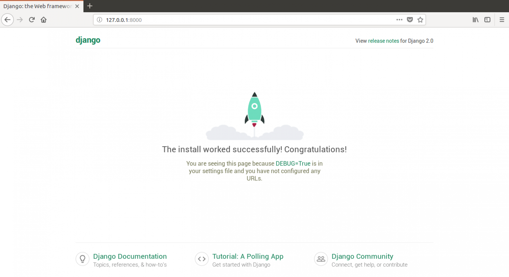

# Django的安装及第一个项目

### Django的安装及测试

进入虚拟环境或PyCharm提供的terminal终端，输入如下命令即可安装最新Django版本。当然你还可以通过==指定所需的Django版本。

```
pip install django
pip install django==3.1.6 # 安装指定版本
```

在Linux系统的命令行或windows的CMD终端中输入python即进入Python交互环境(shell)，然后可通过查看已安装的Django版本来确定Django已安装成功。

```
>>> import django
>>> print(django.get_version())
3.1.6
```

### 第一个Django项目

进入myproject1的虚拟环境, 使用如下命令创建一个名为mysite的项目。

```
django-admin startproject mysite
```

你会看到myproject1目录下增加了一个名为`mysite’的文件夹和多个文件。每个文件夹和文件的作用如下所示：

```
mysite/ # 根目录
    manage.py # Django命令行工具
    mysite/ # 项目配置目录
        __init__.py # 空文件，告诉python这个目录是python包
        settings.py # 项目配置文件
        urls.py # 项目所有urls声明汇总
        asgi.py # ASGI服务器的入口文件
        wsgi.py # WSGI服务器的入口文件
```

现在进入命令终端使用如下命令启动测试服务器：

```
python manage.py runserver
```

此时打开浏览器访问 [http://127.0.0.1:8000/](http://127.0.0.1:8000/)，你将看到熟悉的火箭标志页面(图片来源于网络)，如下所示：

